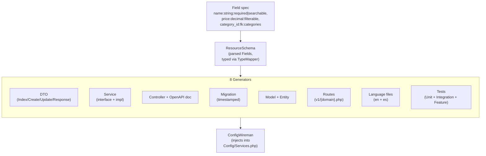

# ci4-api-core

[](https://github.com/dcardenasl/ci4-api-core/actions/workflows/ci.yml)
[](https://codecov.io/gh/dcardenasl/ci4-api-core)
[](LICENSE)
[](https://packagist.org/packages/dcardenasl/ci4-api-core)
[](https://packagist.org/packages/dcardenasl/ci4-api-core)

Production-ready REST API foundation for CodeIgniter 4. Drop it into any CI4 project to get a DTO-first architecture, JWT-ready HTTP layer, audit trail, queue, RBAC-ready filters, and a repository pattern — without writing boilerplate. Pair with [`dcardenasl/ci4-api-scaffolding`](https://github.com/dcardenasl/ci4-api-scaffolding) to scaffold full CRUD modules in one command.

> **Status:** `v1.0.0` — stable, published on Packagist. Semantic versioning applies from this release: `^1.0` is safe for production.

## Contents

- [Quick Start](#quick-start)
- [What it does](#what-it-does)
- [Why a package](#why-a-package)
- [Runtime foundation](#runtime-foundation)
- [Requirements](#requirements)
- [Installation](#installation)
- [Configure](#configure)
- [Usage](#usage)
- [Field syntax](#field-syntax)
- [Scope and limitations](#scope-and-limitations-v0x)
- [Customization](#customization)
- [Scaffolding contract](#scaffolding-contract)
- [Wiring assumption](#wiring-assumption)
- [Troubleshooting](#troubleshooting)
- [See also](#see-also)
- [Toward 1.0](#toward-10)
- [Development](#development)
- [License](#license)

## Quick Start

```bash
# Runtime foundation
composer require dcardenasl/ci4-api-core:^1.0

# Scaffolding engine (dev-only — provides make-crud.sh and spark commands)
composer require --dev dcardenasl/ci4-api-scaffolding:^0.7

# Scaffold a CRUD module
bash vendor/bin/make-crud.sh Product Catalog \
  'name:string:required|searchable,price:decimal:required|filterable' yes

# Validate wiring
php spark module:check Product --domain Catalog
```

## What it does

> **Package boundary:** `ci4-api-core` provides the **runtime foundation** — base classes, HTTP layer, services, repositories, models, filters, audit chain, queue, and security utilities. The scaffolding engine (generators, `make-crud.sh`, spark commands) lives in the companion package `dcardenasl/ci4-api-scaffolding`. The flowchart below shows the full system when both packages are installed.

Generates a complete, production-ready CRUD module from a single command:

```bash
bash vendor/bin/make-crud.sh Product Catalog \
  'name:string:required|searchable,price:decimal:required|filterable,category_id:fk:categories:required' \
  yes
```



Outputs:

- 4 DTOs (Index/Create/Update request + Response) with validation and OpenAPI annotations
- Service interface + implementation extending your base CRUD service
- Controller with explicit CRUD methods and OpenAPI doc class
- Timestamped database migration
- Model + Entity extending your auditable base
- Route file under `app/Config/Routes/v1/{domain-kebab}.php`
- Language files (`en` + `es`)
- Unit / Integration / Feature test skeletons
- Service registrations injected into `Config/Services.php` (or printed for manual paste with `--no-wire`)

## Why a package

The engine was being copied between projects manually, leading to drift. Extracting it gives:

- **Single source of truth** — bug fixes apply to all consumers via `composer update`.
- **Versioned upgrades** — projects pin to a constraint and adopt new versions when ready.
- **Configurable conventions** — base class FQCNs, paths, and route filters are declared per project in `Config\Scaffolding`.

## Runtime foundation

`ci4-api-core` ships the classes that generated (and hand-written) modules extend and depend on at runtime:

| Layer | Key classes |
|-------|-------------|
| **HTTP** | `ApiController` (`handleRequest()` pipeline), `ApiRequest`, `ApiResponse`, `ContextHolder`, `RequestIdHolder` |
| **HTTP filters** | `CorsFilter`, `CorrelationIdFilter`, `IdempotencyFilter`, `LocaleFilter`, `MaintenanceFilter`, `RequestLoggingFilter`, `DeprecationHeadersFilter`, `FeatureToggleFilter` |
| **DTOs** | `BaseRequestDTO` (auto-validation), `PaginatedResponseDTO`, `DataTransferObjectInterface`, `SecurityContext` |
| **Services** | `BaseCrudService`, `CrudServiceContract`, `HandlesTransactions` trait, `AuditService`, `AuditServiceInterface`, `NullAuditService` |
| **Repositories** | `RepositoryInterface`, `GenericRepository`, `BaseRepository`, `AuditRepositoryInterface` |
| **Models** | `BaseAuditableModel`, `Auditable` trait, `Filterable` trait, `Searchable` trait, `DecimalCast` |
| **Query layer** | `FilterParser`, `FilterOperatorApplier`, `SearchQueryApplier`, `QueryBuilder` |
| **Exceptions** | `ApiException` + `NotFoundException`, `ValidationException`, `BadRequestException`, `AuthenticationException`, `AuthorizationException`, `ConflictException`, `ServiceUnavailableException`, `TooManyRequestsException` |
| **Support** | `OperationResult`, `OperationState` enum, `ApiResult`, `ExceptionFormatter`, `ApiConfigFacade` · `RelationLabelLoader` (batch label loading, no N+1) · `CacheHelper` (cache-aside in one line) · `DateHelper` (null-safe date normalisation) — see [`docs/SUPPORT_UTILITIES.md`](docs/SUPPORT_UTILITIES.md) |
| **Security** | `Security\Hasher`, `Security\Token`, `Security\Mask` |
| **Queue** | `QueueManager`, `SyncQueueManager`, `Job` base, `WriteAuditLogJob`, `LogRequestJob` |
| **Logging** | `JsonFormatter`, `MonologHandler` |

## Requirements

- PHP `^8.2`
- CodeIgniter 4 `^4.7`

## Installation

```bash
composer require dcardenasl/ci4-api-core:^1.0
```

## Configure

### Runtime — `Config\Api` (optional)

`ci4-api-core` reads an optional `Config\Api` class for search and pagination knobs. Defaults are safe when absent:

```php
<?php

declare(strict_types=1);

namespace Config;

use CodeIgniter\Config\BaseConfig;

class Api extends BaseConfig
{
    public bool $searchEnabled        = true;
    public bool $searchUseFulltext    = true;  // MATCH AGAINST; false = LIKE
    public int  $searchMinLength      = 0;     // minimum query length
    public int  $paginationDefaultLimit = 20;
    public int  $paginationMaxLimit     = 100;
}
```

### Scaffolding — `Config\Scaffolding` (`ci4-api-scaffolding`)

Create `app/Config/Scaffolding.php` in your project. If your project follows the default conventions exactly, a one-liner is sufficient:

```php
<?php

declare(strict_types=1);

namespace Config;

use dcardenasl\Ci4ApiScaffolding\Config\BaseScaffoldingConfig;
use dcardenasl\Ci4ApiScaffolding\Config\ScaffoldingConfig;

class Scaffolding extends BaseScaffoldingConfig
{
    public function build(): ScaffoldingConfig
    {
        return ScaffoldingConfig::defaults();
    }
}
```

If omitted, the spark commands fall back to `ScaffoldingConfig::defaults()` with a warning.

### Wiring — `php spark core:install`

After adding the package, run the wiring wizard to inject the required service factories into `app/Config/Services.php`:

```bash
php spark core:install
```

The command detects which of the 4 required factories are already present and generates only the missing stubs. Re-running against an already-wired project is a no-op.

## Usage

### Scaffold a new CRUD module

```bash
bash vendor/bin/make-crud.sh <Resource> <Domain> '<Fields>' [SoftDelete=yes] [Route]
```

Always wrap `<Fields>` in **single quotes** — the `|` modifier separator is shell-special.

```bash
# Default (auto-pluralized route slug):
bash vendor/bin/make-crud.sh Product Catalog \
  'name:string:required|searchable,price:decimal:required|filterable' \
  yes

# Custom route slug:
bash vendor/bin/make-crud.sh UpaEvent Events \
  'title:string:required|searchable,year:int:required|filterable' \
  yes upa-events

# Lookup table — no soft delete:
bash vendor/bin/make-crud.sh Status Catalog 'name:string:required|searchable' no
```

### Options

| Flag | Effect |
|------|--------|
| `--dry-run` | Preview the planned file list and wiring snippets without writing anything. |
| `--no-wire` | Skip auto-injection into `Config/Services.php`; print the snippets for manual paste. |

### Validate and apply

After scaffolding, run in order:

```bash
php spark module:check <Resource> --domain <Domain>  # verify all artifacts wired
php spark migrate                                     # apply the generated migration
pkill -f 'spark serve'; php spark serve --port 8080 & # restart (routes are not hot-reloaded)
php spark swagger:generate                            # regenerate OpenAPI spec
```

### Remove a module

```bash
php spark make:crud:remove <Resource> --domain <Domain>
```

Deletes all generated artifacts and un-wires the service registration.

## Field syntax

Format: `name:type:modifier1|modifier2`

**Supported types:**

| Type | Database column | PHP type |
|------|----------------|----------|
| `string` | `VARCHAR(255)` | `string` |
| `text` | `TEXT` | `string` |
| `int` | `INT UNSIGNED` | `int` |
| `decimal` | `DECIMAL(10,2)` | `float` |
| `bool` | `TINYINT(1)` | `bool` |
| `email` | `VARCHAR(255)` | `string` |
| `date` | `DATE` | `string` |
| `datetime` | `DATETIME` | `string` |
| `json` | `JSON` | `array` |
| `fk:table` | `INT UNSIGNED + FK` | `int` |

**Supported modifiers:**

| Modifier | Effect |
|----------|--------|
| `required` | `NOT NULL` + `required` validation rule |
| `nullable` | `NULL` + `permit_empty` validation rule |
| `searchable` | Included in `?search=` (LIKE); adds B-tree index |
| `filterable` | Included in `?filter[col]=` (exact match); adds B-tree index |
| `unique` | `UNIQUE` index + `is_unique[table.col]` on the Create DTO |
| `index` | Non-unique B-tree index |
| `fk:table` | Foreign key to `table.id` + `is_not_unique[table.id]` validation |

Invalid or reserved field names are rejected upfront (PHP keywords, MySQL reserved words, `id`, `created_at`, `updated_at`, `deleted_at`).

## Scope and limitations (v0.x)

The generator is designed for **flat resources**: one resource = one table = one set of CRUD endpoints. This is intentional — most domain entities are flat, and "smart" relation handling tends to over-engineer the simple case.

**What `fk:<table>` does today:**

- Adds an `INT UNSIGNED` column with the right name (`{name}_id` if you write `category_id:fk:categories`).
- Generates a `FOREIGN KEY` constraint in the migration.
- Adds `is_not_unique[table.id]` validation to the Create DTO so non-existent IDs are rejected at the API boundary.
- Optionally validates the target table exists at scaffold time (DB-reachability check; opt-out with `--skip-fk-validation`).

**What it does NOT do — wire by hand if you need it:**

- ❌ No `hasMany` / `belongsTo` accessor methods on the Entity.
- ❌ No automatic eager-loading of the related resource in the Response DTO (the parent is returned as `category_id: int`, not `category: {...}`).
- ❌ No nested route shapes (e.g. `GET /categories/{id}/products`).
- ❌ No reverse-side scaffolding (creating a `Product` does not regenerate the `Category` Service to expose `getProducts()`).
- ❌ No transactional cross-resource creation (e.g. POSTing a `Category` with embedded `Product[]` payloads).

If your domain needs any of the above, scaffold both resources flat first, then hand-edit the Service / Response DTO of the parent to load and expose the child collection. This is rarely more than ~30 lines of code per relation, and keeps the generator's surface small enough to remain stable across versions.

> **Roadmap:** relation-aware generators are tracked in `ci4-api-scaffolding`'s backlog (`CRUD-003`). The pre-1.0 API may still change.

## Customization

Override any convention by passing a customized `ScaffoldingConfig` from your `build()` method:

```php
public function build(): ScaffoldingConfig
{
    return new ScaffoldingConfig(
        controllerBaseClass:          'App\\Controllers\\ApiController',
        serviceBaseClass:             'App\\Services\\Core\\BaseCrudService',
        serviceContractInterface:     'App\\Interfaces\\Core\\CrudServiceContract',
        modelBaseClass:               'App\\Models\\BaseAuditableModel',
        entityBaseClass:              'CodeIgniter\\Entity\\Entity',
        migrationBaseClass:           'CodeIgniter\\Database\\Migration',
        requestDtoBaseClass:          'App\\DTO\\Request\\BaseRequestDTO',
        responseDtoInterface:         'App\\Interfaces\\DataTransferObjectInterface',
        repositoryInterface:          'App\\Interfaces\\Core\\RepositoryInterface',
        responseMapperInterface:      'App\\Interfaces\\Mappers\\ResponseMapperInterface',
        repositoryImplementation:     'App\\Repositories\\GenericRepository',
        responseMapperImplementation: 'App\\Services\\Core\\Mappers\\DtoResponseMapper',
        servicesFactoryClass:         'Config\\Services',
        paths: new ScaffoldingPaths(
            controllers: 'Controllers/Api/V2',  // override individual paths
        ),
        protectedRouteFilters: ['jwtauth', 'permission:resources.write', 'throttle'],
        appNamespace: 'App',
    );
}
```

`ScaffoldingPaths` defaults (relative to `APPPATH`, except tests which are relative to `ROOTPATH`):

| Field | Default |
|-------|---------|
| `controllers` | `Controllers/Api/V1` |
| `services` | `Services` |
| `interfaces` | `Interfaces` |
| `requestDtos` | `DTO/Request` |
| `responseDtos` | `DTO/Response` |
| `documentation` | `Documentation` |
| `models` | `Models` |
| `entities` | `Entities` |
| `migrations` | `Database/Migrations` |
| `routes` | `Config/Routes/v1` |
| `languageEn` | `Language/en` |
| `languageEs` | `Language/es` |
| `unitTests` | `tests/Unit/Services` |
| `integrationTests` | `tests/Integration/Models` |
| `featureTests` | `tests/Feature/Controllers` |

## Scaffolding contract

The engine generates code that extends specific base classes. Your project must provide these (or override them in `Config\Scaffolding`):

| Symbol | Default FQCN | Purpose |
|--------|-------------|---------|
| Controller base | `App\Controllers\ApiController` | `handleRequest()` pipeline |
| Service base | `App\Services\Core\BaseCrudService` | CRUD lifecycle |
| Service interface | `App\Interfaces\Core\CrudServiceContract` | Type contract |
| Model base | `App\Models\BaseAuditableModel` | `created_by` / `updated_by` audit |
| Request DTO base | `App\DTO\Request\BaseRequestDTO` | Auto-validation |
| Response DTO interface | `App\Interfaces\DataTransferObjectInterface` | Response shape |
| Repository interface | `App\Interfaces\Core\RepositoryInterface` | Generic persistence |
| Repository impl | `App\Repositories\GenericRepository` | Default CRUD impl |
| Response mapper interface | `App\Interfaces\Mappers\ResponseMapperInterface` | DTO mapping |
| Response mapper impl | `App\Services\Core\Mappers\DtoResponseMapper` | Default mapper |

These are the defaults in `ScaffoldingConfig::defaults()`.

### Wiring assumption

`ConfigWireman` (the auto-wiring component) uses regex injection against `app/Config/Services.php`. It looks for a trait import line matching `use {Domain}DomainServices;` and injects the new service factory method there. If your `Services.php` has a non-standard layout, pass `--no-wire` and paste the printed snippet manually.

## Troubleshooting

**`php spark make:crud` prompted me for fields even though I passed `--fields='…'`**
You're in a non-TTY environment and the shell consumed the pipe characters. Use `vendor/bin/make-crud.sh` — it handles quoting correctly and is safe in CI and automation scripts.

**Routes return 404 after scaffolding**
CI4 loads route files at boot only. Restart the server:
```bash
pkill -f 'spark serve'; php spark serve --port 8080 &
```

**`ScaffoldConflictException: files already exist`**
Artifacts from a previous scaffold are still on disk. Either migrate + commit the previous module, or remove the stale files and try again. The orchestrator rolls back partial writes on failure, so the conflict is always pre-existing state, not a failed run.

**Pre-commit hook rejects generated files**
`vendor/bin/make-crud.sh` runs `composer cs-fix` automatically post-generation. If you used `php spark make:crud` directly:
```bash
composer cs-fix && git add -u && git commit
```
Never skip with `--no-verify`.

**Auto-wiring silently skipped**
The commands fall back to `--no-wire` behaviour if they cannot locate the trait import line. Check the output — it will print the snippet for manual paste. Use `--no-wire` explicitly if your `Services.php` layout differs from the default.

## Example Project

[**ci4-api-core-example**](https://github.com/dcardenasl/ci4-api-core-example) is a complete, runnable Catalog API (Categories + Products) built entirely with scaffolding — minimal hand-written code. Each step is a separate git commit so you can trace exactly what gets generated, from a blank CI4 project to a production-ready API with filtering, searching, pagination, and OpenAPI docs.

## See also

- [`docs/ARCHITECTURE_CONTRACT.md`](docs/ARCHITECTURE_CONTRACT.md) — non-negotiable layer rules for modules built on this package.
- [`docs/CRUD_FROM_ZERO.md`](docs/CRUD_FROM_ZERO.md) — step-by-step playbook for scaffolding a module from a blank field spec.
- [`docs/SUPPORT_UTILITIES.md`](docs/SUPPORT_UTILITIES.md) — `RelationLabelLoader`, `CacheHelper`, `DateHelper`: benefits, usage guide, and API reference.
- [`docs/EXTENDING_IAM.md`](docs/EXTENDING_IAM.md) — plug in any identity provider (Shield, OAuth, Keycloak, …).
- [`docs/EXTENDING_THROTTLE.md`](docs/EXTENDING_THROTTLE.md) — custom rate-limit strategies.
- [`docs/EXTENDING_QUEUE.md`](docs/EXTENDING_QUEUE.md) — alternative queue backends.
- [`docs/EXTENDING_AUDIT.md`](docs/EXTENDING_AUDIT.md) — replace or extend the audit pipeline.

## Toward 1.0

### What is stable today

The following surfaces have integration tests and are considered stable. Changes here will carry a `BREAKING` tag in the changelog.

| Area | Stable classes / interfaces |
|------|-----------------------------|
| HTTP layer | `ApiController`, `ApiRequest`, `ApiResponse`, `ContextHolder`, `RequestIdHolder` |
| Exception hierarchy | `ApiException` + all 8 concrete exceptions, `ExceptionFormatter` |
| DTO contracts | `DataTransferObjectInterface`, `BaseRequestDTO`, `PaginatedResponseDTO`, `SecurityContext` |
| Repository contract | `RepositoryInterface`, `BaseRepository`, `GenericRepository` |
| Audit chain | `AuditService`, `AuditWriter`, `AuditPayloadSanitizer`, `AuditServiceInterface`, `NullAuditService` |
| Queue contract | `QueueManager`, `SyncQueueManager`, `Job`, `WriteAuditLogJob` |
| Security utilities | `Security\Hasher`, `Security\Token`, `Security\Mask` |
| Concrete filters (9) | `CorrelationIdFilter`, `CorsFilter`, `SecurityHeadersFilter`, `FeatureToggleFilter`, `IdempotencyFilter`, `LocaleFilter`, `MaintenanceFilter`, `RequestLoggingFilter`, `DeprecationHeadersFilter` |
| Abstract filter bases (3) | `AbstractJwtAuthFilter`, `AbstractPermissionFilter`, `AbstractThrottleFilter` |

### What may still change before 1.0

| Surface | Likelihood | Notes |
|---------|-----------|-------|
| `BaseCrudService` hook signatures (`beforeStore`, `afterUpdate`, etc.) | Low | Signature is clean, but exact parameter set may gain a `$context` overload |
| `HealthChecker` constructor | Medium | Planned: accept an injected `BaseConnection` so it is testable without a live DB connection |
| IAM hook surface (`AbstractIamAuthorizationService`) | Medium | May gain a standardized `resolvePermissions()` contract before 1.0 |

### Criteria for 1.0.0

1. All stable-surface classes have integration tests with verified behavior.
2. `HealthChecker` accepts an injected `BaseConnection` — testable without a live database.
3. At least one documented real-world consumer running in production.
4. Infection PHP Mutation Score Indicator (MSI) ≥ 80% across the Unit + Integration suite.
5. No open `BREAKING` items in `CHANGELOG.md [Unreleased]`.

## Development

```bash
composer install
composer test      # PHPUnit
composer analyse   # PHPStan level 8
```

Tests run without bootstrapping a CI4 app — `tests/bootstrap.php` defines the minimum `APPPATH`/`ROOTPATH` shims.

## License

MIT — see [LICENSE](LICENSE).
