# ci4-api-core

[](https://github.com/dcardenasl/ci4-api-core/actions/workflows/ci.yml)
[](https://codecov.io/gh/dcardenasl/ci4-api-core)
[](LICENSE)

DTO-first API foundation for CodeIgniter 4: base classes + CRUD scaffolding engine. Powers `ci4-api-starter` and `ci4-domain-starter` so multiple projects share a single, versioned source of truth instead of copying the engine between codebases.

> **Status:** `v0.2.0` — packaging hardening. APIs may change without notice until `1.0.0`. Not yet published to Packagist; install via VCS repository (see below).

## What it does

Generates a complete, production-ready CRUD module from a single command:

```bash
bash vendor/bin/make-crud.sh Product Catalog \
  'name:string:required|searchable,price:decimal:required|filterable,category_id:fk:categories:required' \
  yes
```



```mermaid
flowchart LR
    Input["Field spec<br/>name:string:required|searchable,<br/>price:decimal:filterable,<br/>category_id:fk:categories"]
    Schema["ResourceSchema<br/>(parsed Fields,<br/>typed via TypeMapper)"]

    subgraph Generators["8 Generators"]
        direction TB
        DTO["DTO<br/>(Index/Create/Update/Response)"]
        Service["Service<br/>(interface + impl)"]
        Controller["Controller + OpenAPI doc"]
        Migration["Migration<br/>(timestamped)"]
        Model["Model + Entity"]
        Routes["Routes<br/>(v1/{domain}.php)"]
        Lang["Language files<br/>(en + es)"]
        Tests["Tests<br/>(Unit + Integration + Feature)"]
    end

    Wiring["ConfigWireman<br/>(injects into<br/>Config/Services.php)"]

    Input --> Schema --> Generators --> Wiring
```

Outputs:

- 4 DTOs (Index/Create/Update request + Response) with validation and OpenAPI annotations
- Service interface + implementation extending your base CRUD service
- Controller with explicit CRUD methods and OpenAPI doc class
- Timestamped database migration
- Model + Entity extending your auditable base
- Route file under `app/Config/Routes/v1/{domain-kebab}.php`
- Language files (`en` + `es`)
- Unit / Integration / Feature test skeletons
- Service registrations injected into `Config/Services.php` (or printed for manual paste with `--no-wire`)

## Why a package

The engine was being copied between projects manually, leading to drift. Extracting it gives:

- **Single source of truth** — bug fixes apply to all consumers via `composer update`.
- **Versioned upgrades** — projects pin to a constraint and adopt new versions when ready.
- **Configurable conventions** — base class FQCNs, paths, and route filters are declared per project in `Config\Scaffolding`.

## Requirements

- PHP `^8.2`
- CodeIgniter 4 `^4.5`

## Installation

Add the VCS repository to your project's `composer.json` and require the package:

```json
"repositories": [
    {
        "type": "vcs",
        "url": "https://github.com/dcardenasl/ci4-api-core"
    }
],
"require-dev": {
    "dcardenasl/ci4-api-core": "^0.1.0"
}
```

Then install:

```bash
composer update dcardenasl/ci4-api-core --no-interaction
```

## Configure

Create `app/Config/Scaffolding.php` in your project. If your project follows the `ci4-api-starter` conventions exactly, a one-liner is sufficient:

```php
<?php

declare(strict_types=1);

namespace Config;

use dcardenasl\Ci4ApiCore\Config\BaseScaffoldingConfig;
use dcardenasl\Ci4ApiCore\Config\ScaffoldingConfig;

class Scaffolding extends BaseScaffoldingConfig
{
    public function build(): ScaffoldingConfig
    {
        return ScaffoldingConfig::defaults();
    }
}
```

If omitted, the spark commands fall back to `ScaffoldingConfig::defaults()` with a warning.

## Usage

### Scaffold a new CRUD module

```bash
bash vendor/bin/make-crud.sh <Resource> <Domain> '<Fields>' [SoftDelete=yes] [Route]
```

Always wrap `<Fields>` in **single quotes** — the `|` modifier separator is shell-special.

```bash
# Default (auto-pluralized route slug):
bash vendor/bin/make-crud.sh Product Catalog \
  'name:string:required|searchable,price:decimal:required|filterable' \
  yes

# Custom route slug:
bash vendor/bin/make-crud.sh UpaEvent Events \
  'title:string:required|searchable,year:int:required|filterable' \
  yes upa-events

# Lookup table — no soft delete:
bash vendor/bin/make-crud.sh Status Catalog 'name:string:required|searchable' no
```

### Options

| Flag | Effect |
|------|--------|
| `--dry-run` | Preview the planned file list and wiring snippets without writing anything. |
| `--no-wire` | Skip auto-injection into `Config/Services.php`; print the snippets for manual paste. |

### Validate and apply

After scaffolding, run in order:

```bash
php spark module:check <Resource> --domain <Domain>  # verify all artifacts wired
php spark migrate                                     # apply the generated migration
pkill -f 'spark serve'; php spark serve --port 8080 & # restart (routes are not hot-reloaded)
php spark swagger:generate                            # regenerate OpenAPI spec
```

### Remove a module

```bash
php spark make:crud:remove <Resource> --domain <Domain>
```

Deletes all generated artifacts and un-wires the service registration.

## Field syntax

Format: `name:type:modifier1|modifier2`

**Supported types:**

| Type | Database column | PHP type |
|------|----------------|----------|
| `string` | `VARCHAR(255)` | `string` |
| `text` | `TEXT` | `string` |
| `int` | `INT UNSIGNED` | `int` |
| `decimal` | `DECIMAL(10,2)` | `float` |
| `bool` | `TINYINT(1)` | `bool` |
| `email` | `VARCHAR(255)` | `string` |
| `date` | `DATE` | `string` |
| `datetime` | `DATETIME` | `string` |
| `json` | `JSON` | `array` |
| `fk:table` | `INT UNSIGNED + FK` | `int` |

**Supported modifiers:**

| Modifier | Effect |
|----------|--------|
| `required` | `NOT NULL` + `required` validation rule |
| `nullable` | `NULL` + `permit_empty` validation rule |
| `searchable` | Included in `?search=` (LIKE); adds B-tree index |
| `filterable` | Included in `?filter[col]=` (exact match); adds B-tree index |
| `unique` | `UNIQUE` index + `is_unique[table.col]` on the Create DTO |
| `index` | Non-unique B-tree index |
| `fk:table` | Foreign key to `table.id` + `is_not_unique[table.id]` validation |

Invalid or reserved field names are rejected upfront (PHP keywords, MySQL reserved words, `id`, `created_at`, `updated_at`, `deleted_at`).

## Scope and limitations (v0.x)

The generator is designed for **flat resources**: one resource = one table = one set of CRUD endpoints. This is intentional — most domain entities are flat, and "smart" relation handling tends to over-engineer the simple case.

**What `fk:<table>` does today:**

- Adds an `INT UNSIGNED` column with the right name (`{name}_id` if you write `category_id:fk:categories`).
- Generates a `FOREIGN KEY` constraint in the migration.
- Adds `is_not_unique[table.id]` validation to the Create DTO so non-existent IDs are rejected at the API boundary.
- Optionally validates the target table exists at scaffold time (DB-reachability check; opt-out with `--skip-fk-validation`).

**What it does NOT do — wire by hand if you need it:**

- ❌ No `hasMany` / `belongsTo` accessor methods on the Entity.
- ❌ No automatic eager-loading of the related resource in the Response DTO (the parent is returned as `category_id: int`, not `category: {...}`).
- ❌ No nested route shapes (e.g. `GET /categories/{id}/products`).
- ❌ No reverse-side scaffolding (creating a `Product` does not regenerate the `Category` Service to expose `getProducts()`).
- ❌ No transactional cross-resource creation (e.g. POSTing a `Category` with embedded `Product[]` payloads).

If your domain needs any of the above, scaffold both resources flat first, then hand-edit the Service / Response DTO of the parent to load and expose the child collection. This is rarely more than ~30 lines of code per relation, and keeps the generator's surface small enough to remain stable across versions.

> **Roadmap:** relation-aware generators are tracked as a v0.3 candidate. See `TASKS.md` and the v0.3 design notes once they land in `docs/`. The pre-1.0 API may still change.

## Customization

Override any convention by passing a customized `ScaffoldingConfig` from your `build()` method:

```php
public function build(): ScaffoldingConfig
{
    return new ScaffoldingConfig(
        controllerBaseClass:          'App\\Controllers\\ApiController',
        serviceBaseClass:             'App\\Services\\Core\\BaseCrudService',
        serviceContractInterface:     'App\\Interfaces\\Core\\CrudServiceContract',
        modelBaseClass:               'App\\Models\\BaseAuditableModel',
        entityBaseClass:              'CodeIgniter\\Entity\\Entity',
        migrationBaseClass:           'CodeIgniter\\Database\\Migration',
        requestDtoBaseClass:          'App\\DTO\\Request\\BaseRequestDTO',
        responseDtoInterface:         'App\\Interfaces\\DataTransferObjectInterface',
        repositoryInterface:          'App\\Interfaces\\Core\\RepositoryInterface',
        responseMapperInterface:      'App\\Interfaces\\Mappers\\ResponseMapperInterface',
        repositoryImplementation:     'App\\Repositories\\GenericRepository',
        responseMapperImplementation: 'App\\Services\\Core\\Mappers\\DtoResponseMapper',
        servicesFactoryClass:         'Config\\Services',
        paths: new ScaffoldingPaths(
            controllers: 'Controllers/Api/V2',  // override individual paths
        ),
        protectedRouteFilters: ['jwtauth', 'permission:resources.write', 'throttle'],
        appNamespace: 'App',
    );
}
```

`ScaffoldingPaths` defaults (relative to `APPPATH`, except tests which are relative to `ROOTPATH`):

| Field | Default |
|-------|---------|
| `controllers` | `Controllers/Api/V1` |
| `services` | `Services` |
| `interfaces` | `Interfaces` |
| `requestDtos` | `DTO/Request` |
| `responseDtos` | `DTO/Response` |
| `documentation` | `Documentation` |
| `models` | `Models` |
| `entities` | `Entities` |
| `migrations` | `Database/Migrations` |
| `routes` | `Config/Routes/v1` |
| `languageEn` | `Language/en` |
| `languageEs` | `Language/es` |
| `unitTests` | `tests/Unit/Services` |
| `integrationTests` | `tests/Integration/Models` |
| `featureTests` | `tests/Feature/Controllers` |

## Scaffolding contract

The engine generates code that extends specific base classes. Your project must provide these (or override them in `Config\Scaffolding`):

| Symbol | Default FQCN | Purpose |
|--------|-------------|---------|
| Controller base | `App\Controllers\ApiController` | `handleRequest()` pipeline |
| Service base | `App\Services\Core\BaseCrudService` | CRUD lifecycle |
| Service interface | `App\Interfaces\Core\CrudServiceContract` | Type contract |
| Model base | `App\Models\BaseAuditableModel` | `created_by` / `updated_by` audit |
| Request DTO base | `App\DTO\Request\BaseRequestDTO` | Auto-validation |
| Response DTO interface | `App\Interfaces\DataTransferObjectInterface` | Response shape |
| Repository interface | `App\Interfaces\Core\RepositoryInterface` | Generic persistence |
| Repository impl | `App\Repositories\GenericRepository` | Default CRUD impl |
| Response mapper interface | `App\Interfaces\Mappers\ResponseMapperInterface` | DTO mapping |
| Response mapper impl | `App\Services\Core\Mappers\DtoResponseMapper` | Default mapper |

These are the defaults in `ScaffoldingConfig::defaults()` and match `ci4-api-starter` exactly.

### Wiring assumption

`ConfigWireman` (the auto-wiring component) uses regex injection against `app/Config/Services.php`. It looks for a trait import line matching `use {Domain}DomainServices;` and injects the new service factory method there. If your `Services.php` has a non-standard layout, pass `--no-wire` and paste the printed snippet manually.

## Migration from an inline copy

If your project has `app/Support/Scaffolding/` (the inline copy shipped with `ci4-api-starter`):

1. Follow the **Installation** and **Configure** steps above.
2. Verify the package's spark commands are discovered before the inline ones (they share the same `$name`, so CI4 will pick one):
   ```bash
   php spark list | grep -E '(make:crud|module:check)'
   ```
3. Run a dry-run scaffold and compare output against the inline version:
   ```bash
   bash vendor/bin/make-crud.sh TestExtraction TestDomain 'name:string:required' yes --dry-run
   ```
4. Only after confirming parity, delete the inline files:
   - `app/Support/Scaffolding/` (entire directory)
   - `app/Commands/MakeCrud.php`, `MakeCrudRemove.php`, `ModuleCheck.php`
   - `bin/make-crud.sh`, `bin/validate-crud.sh`
   - Any tests that were ported to the package's own test suite
5. Run `composer quality` to confirm nothing broke.

## Troubleshooting

**`php spark make:crud` prompted me for fields even though I passed `--fields='…'`**
You're in a non-TTY environment and the shell consumed the pipe characters. Use `vendor/bin/make-crud.sh` — it handles quoting correctly and is safe in CI and automation scripts.

**Routes return 404 after scaffolding**
CI4 loads route files at boot only. Restart the server:
```bash
pkill -f 'spark serve'; php spark serve --port 8080 &
```

**`ScaffoldConflictException: files already exist`**
Artifacts from a previous scaffold are still on disk. Either migrate + commit the previous module, or remove the stale files and try again. The orchestrator rolls back partial writes on failure, so the conflict is always pre-existing state, not a failed run.

**Pre-commit hook rejects generated files**
`vendor/bin/make-crud.sh` runs `composer cs-fix` automatically post-generation. If you used `php spark make:crud` directly:
```bash
composer cs-fix && git add -u && git commit
```
Never skip with `--no-verify`.

**Auto-wiring silently skipped**
The commands fall back to `--no-wire` behaviour if they cannot locate the trait import line. Check the output — it will print the snippet for manual paste. Use `--no-wire` explicitly if your `Services.php` layout differs from the default.

## See also

- [`docs/CRUD_FROM_ZERO.md`](docs/CRUD_FROM_ZERO.md) — step-by-step playbook for scaffolding and post-scaffold customization.
- [`docs/ARCHITECTURE_CONTRACT.md`](docs/ARCHITECTURE_CONTRACT.md) — non-negotiable layer rules for modules built with this engine.

## Development

```bash
composer install
composer test      # PHPUnit
composer analyse   # PHPStan level 5
```

Tests run without bootstrapping a CI4 app — `tests/bootstrap.php` defines the minimum `APPPATH`/`ROOTPATH` shims.

## License

MIT — see [LICENSE](LICENSE).
